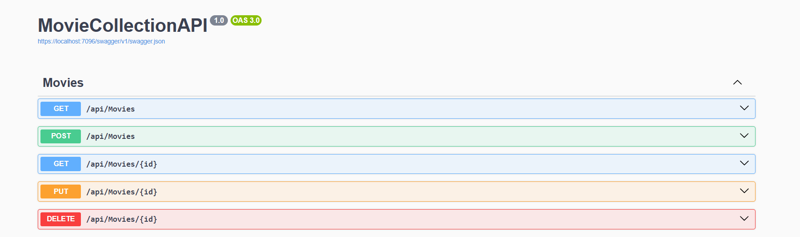

# 🎬 MovieFlix Backend API

A simple and powerful **ASP.NET Core Web API** for managing movies in the MovieFlix platform.

## 🚀 Features
- CRUD operations (Create, Read, Update, Delete) for movies
- Connects with SQL Server (or any EF Core supported database)
- CORS enabled for frontend communication
- Optimized for production deployment

## 🛠 Tech Stack
- ASP.NET Core 8 Web API
- Entity Framework Core
- SQL Server / SQLite (your choice)
- TMDB API integration (handled in frontend)
